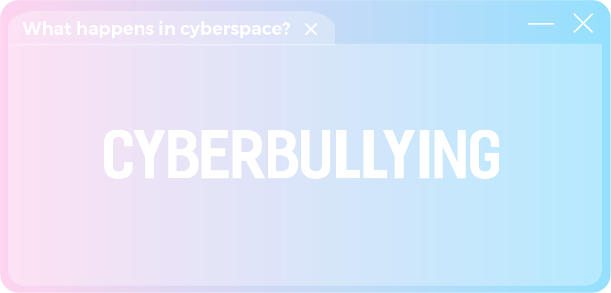
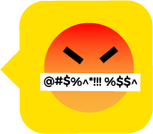

<!DOCTYPE html>
<html lang="en"> 

<head>

    <meta charset="UTF-8">
    <meta name="viewport" content="width=device-width, initial-scale=1.0, user-scalable=no">
    <title> Behind The Screen </title>
    <link rel="stylesheet" type="text/css" href="style.css">

    
    <link rel="stylesheet" href="https://maxcdn.bootstrapcdn.com/bootstrap/3.3.7/css/bootstrap.min.css">
    
    
    
    <link rel="stylesheet" href="https://use.fontawesome.com/releases/v5.15.0/css/all.css">

    <!-- <link href="https://fonts.googleapis.com/icon?family=Material+Icons" rel="stylesheet"> -->

</head>

<body>

    

        

            Whoops! Screen less than 1023px wide is not supported.   Please comeback on a computer to experience our website.
        

    

    <button>
        <!-- <i class="material-icons">arrow_upward</i> -->
        <i class='fas fa-angle-double-up'></i>
    </button>

    <section class="project">
        

            
            

            

                Click
            

            
            

                <h1> BEHIND </h1>
            

            

                THE SCREEN
            

        

    </section>

    <section class="intro">

        

        

        

            

                

            

            

                

                    Hey
                

                

                    Hello. How it's going?
                

                

                    Wonder if my stress can develop into depression...
                

                

                    Oh no what happened?
                

                

                    Let me know. Maybe I can help
                

                

                    I had always enjoyed sharing my life on social media
                

                

                    I love to share pictures about my daily life, my pretty outfits
                

                

                    But I guess not anymore
                

                

                    I keep receiving bodyshaming comments recently
                

                

                    People keep telling me my body doesn't deserve my cute outfits
                

                

                    That they look so bad on me
                

                

                    I keep blocking and ignoring them
                

                

                    But they just don't stop
                

                

                    Guess it's my fault
                

                

                    Hey. It's not and it will never be your fault
                

                

                    You've got the right to enjoy 
                    your life, love yourself and 
                    wear what you want
                

                

                    It's nothing wrong with sharing 
                    them on social media
                

                

                    It's their fault for misbehaving
                

                

                    That's cyberbullying, a crime, 
                    you know?
                

                

                    What am I supposed to do?
                

                

                    They don't even aware that they're 
                    hurting me
                

                

                    "Just kidding", they say
                

                

                    "No offence", they say
                

                

                    But I'm suffering...
                

                <!-- 

                    Explore
                    
                

                 -->

            

            

                <!-- 

                    Type...
                
 -->
                
                

                    Explore
                

            

        

    </section>

    <section class="title">

        

        

            

                
 Words can kill. 

            

            

                
 Respect and emphathize behind the screen. 

            

            

                
 Stop cyberbullying. 

            
 

            

                
                
                <!--  -->
            

        
        

        

    </section>

    <section class="definition">

        

        

        

            <!-- 
 -->

                <!-- 

                
 -->

                

                

                    

                        Cyberbullying is bullying with the use of digital technologies. 
                        It is repeated behavior that is done on purpose to anger, threat, shame who targeted. 
                    

                    

                        The danger of cyberbullying is getting bigger than ever before because of the growth of information technology 
                        and the prevalence of social media. 
                    

                    
                    
                

                

            <!-- 
 -->

        

        
    </section>

    <section class="danger">

        

        

            

            

                

                    

                        

                            Like face-to-face bullying, cyberbullying can hurt mentally, physically, and emotionally and 
                            left permanent psychological scars on the victims. 
                        

                    

                    

                        

                        

                        

                        

                    

                

                

                

            

        

    

    </section>

    <section class="types">
        
        

        

            

                

                    Harassment
                

                

                    Sending hurtful messages or   threat.
                

            

            

                

                    Masquerading
                

                

                    Impersonating someone and    attacking others on their behalf.
                

            

            

                

                    Outing
                

                

                    Spreading someone's personal    information without their permission.
                

            

            

                

                    Exclusion
                

                

                    Singling someone out of online    group then backbite them.
                

            

        

    </section>

    <section class="data">

        
        
        

        
        

            
            

                

                    

                        

                            About 37% of young people between the ages of 12 and 17 have been bullied online. 30% have had it happen more than once.
                        

                        

                            34% of students had experienced cyberbullying in their lifetime.
                        

                        

                            About half of LGBTQ+ students experience online harassment - a higher rate than average.                
                        

                        

                            In a UNICEF survey in 2019, 21% of Vietnamese respondents said that they were victims of online violence. 
                            Half of them talked about private online groups within the school community used for bullying.                 
                        

                    

                    

                        

                            Young people who experience cyberbullying are at a greater risk than those who don’t for both self-harm and suicidal behaviors
                        

                        

                            64% of people who have been cyberbullied say it affects their ability to learn and feel safe at school.
                        

                        

                            Instagram is the social media site where most young people report experiencing cyberbullying, with 42% of those surveyed experiencing 
                            harassment on the platform.             
                        

                        

                            12% of the students admitted that they had cyberbullied others at some point in their lifetime               
                        

                    

                    

                        <!-- 

                        

            
                        

                        
 -->
                        <!-- <i class="material-icons">unfold_more</i> -->

                        <i class='fas fa-arrow-left'></i>
                        <i class='fas fa-arrow-right'></i>

                    

                

                

            

            

        

        
    </section>

    

    <section class="help">
        

            

                

                    
                

                

            

            

        

        

            

                

                    Share your issues
                

                

                    <!-- 
 -->
                        Talk to someone you trust 
                        and ask for their help.
                    <!-- 
 -->
                

            

            

                

                    
                    Behave well online
                

                

                    <!-- 
 -->
                        

                        Learn how to respect and
                        empathize with others online.
                        Use media in a healthy way.
                    <!-- 
 -->
                

            

            

                

                    
                    Be an upstander
                

                

                    <!-- 
 -->
                       

                        Report any cyberbullying cases if witnessed.
                    Stand up for victims and take appropriate action 
                     to stop cyberbullying.
                    <!-- 
 -->
                

            

            

                

                    Protect yourself
                

                

                    <!-- 
 -->
                        Identify, collect evidence, and report the
                        bully. Ignore, block and delete.
                    <!-- 
 -->
                

            

            

                

                    Search for helplines
                

                

                    <!-- 
 -->
                        Search for helplines in your country and
                        talk to professional counselors.
                         
                    <!-- 
 -->
                

            

            

                

                    Raise awareness
                

                

                    <!-- 
 -->
                         Raise understanding of cyberbullying and 
                          emphasize its danger to people around you.
                    <!-- 
 -->
                

            

        

    </section>

    

</body>

</html>